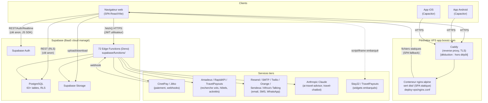
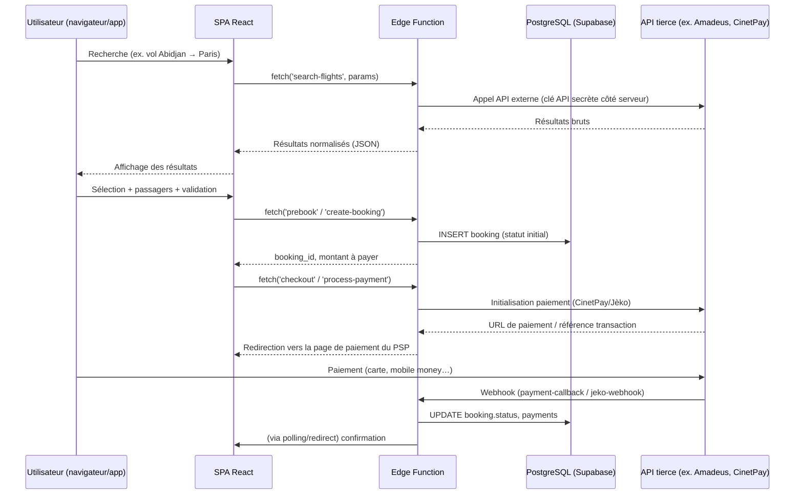

# 01 — Architecture générale

> Statut des sources : les éléments marqués **[constaté]** proviennent directement de la lecture du code (chemin de fichier cité). Les éléments marqués **[déduction]** sont une interprétation raisonnable qui n'est pas littéralement écrite dans le code.

## 1. Vue d'ensemble

B-Reserve (marque commerciale **Bossiz+ / app.bossiz.com**) est une **application web monopage (SPA)** React, packagée pour le mobile via **Capacitor**, adossée à un backend **Supabase** (BaaS : PostgreSQL managé + Auth + Storage + Edge Functions serverless Deno). Il n'existe **pas de serveur applicatif Node/Express custom** : toute la logique serveur constatée réside dans les 72 fonctions Edge de [supabase/functions/](../../supabase/functions/).

- **Frontend** : React 18 + TypeScript, build Vite, UI shadcn/ui + Tailwind CSS — [package.json](../../package.json)
- **Mobile** : le même code web est empaqueté nativement via Capacitor pour Android ([android/](../../android/)) et iOS ([ios/](../../ios/))
- **Backend** : Supabase (projet cloud managé) — base PostgreSQL, authentification, stockage de fichiers, 72 fonctions Edge Deno — [supabase/config.toml](../../supabase/config.toml)
- **Déploiement web** : build statique servi par un conteneur `nginx:alpine`, dont le contenu (`dist/`) est mis à jour par un script shell manuel depuis un poste de développement — [deploy-vps/redeploy.sh](../../deploy-vps/redeploy.sh). Le TLS est terminé en amont par un reverse-proxy **Caddy** (mentionné en commentaire dans [deploy-vps/nginx.conf:41-42](../../deploy-vps/nginx.conf)) qui n'est pas présent dans ce dépôt — **[déduction]** Caddy est probablement configuré directement sur le VPS, hors du dépôt de code.
- **Intégrations tierces** : paiement (CinetPay, Jèko), recherche voyage (Amadeus, RapidAPI/Aerodatabox/Travel Advisor/Flight Fare Search, TravelPayouts), communication (Resend, SMTP générique, Twilio, Orange SMS API, Sendexa, Africa's Talking), IA (Anthropic Claude), notifications push web (VAPID), widgets tiers (Stay22 pour hôtels, TravelPayouts pour vols) — détail en [09-integrations.md](09-integrations.md).

## 2. Diagramme des composants

**Constats sur ce diagramme :**
- Le navigateur communique **directement** avec Supabase (Auth, Postgres via RLS, Storage) en utilisant la clé publique *anon* — [src/integrations/supabase/client.ts](../../src/integrations/supabase/client.ts). Il n'y a pas de couche API intermédiaire pour les opérations CRUD standard : la sécurité repose donc sur les politiques **Row Level Security** de PostgreSQL (voir [04-base-de-donnees.md](04-base-de-donnees.md) et [11-securite.md](11-securite.md)).
- Les Edge Functions sont utilisées pour tout ce qui nécessite un secret serveur (clé API tierce, clé `service_role`), une orchestration multi-étapes (réservation, paiement) ou l'envoi de communications.

## 3. Flux de données — cas d'usage type (recherche + réservation)

Le détail exact de cette séquence, les statuts réellement observés dans la table `bookings` et les fonctions serveur impliquées sont documentés dans [08-flux-critiques.md](08-flux-critiques.md), après vérification ligne à ligne du code des fonctions concernées.

## 4. Frontières de responsabilité

| Couche | Responsabilité constatée | Où |
|---|---|---|
| SPA React | UI, routage, appels Supabase JS SDK, appels `fetch` aux Edge Functions | [src/](../../src/) |
| Supabase Auth | Authentification (email/mot de passe a minima), sessions JWT | [src/integrations/supabase/client.ts](../../src/integrations/supabase/client.ts) |
| PostgreSQL + RLS | Autorisation fine au niveau ligne pour les accès directs du frontend | [supabase/migrations/](../../supabase/migrations/) |
| Edge Functions | Logique métier nécessitant des secrets, orchestration paiement/réservation, communications sortantes, génération de documents | [supabase/functions/](../../supabase/functions/) |
| nginx (VPS) | Service des fichiers statiques, en-têtes de sécurité, CSP | [deploy-vps/nginx.conf](../../deploy-vps/nginx.conf) |
| Caddy | Terminaison TLS (certificat, HTTPS) | **[déduction]** hors dépôt |

## 5. Points d'architecture à clarifier (à approfondir dans les sections suivantes)

- Deux jeux de fichiers Docker/nginx coexistent : ceux à la racine du dépôt ([Dockerfile](../../Dockerfile), [docker-compose.yml](../../docker-compose.yml), [nginx.conf](../../nginx.conf)) semblent être un **template générique non aligné** avec le déploiement réel (ils référencent un utilisateur `nextjs`, `npm run preview` en process de prod, des services `postgres`/`redis` locaux — alors que la base réelle est Supabase Cloud managé et qu'aucun code Next.js n'existe dans le dépôt). Le déploiement réellement utilisé pour app.bossiz.com est celui de [deploy-vps/](../../deploy-vps/) (nginx statique + Caddy en frontal), confirmé par vous en phase 1. Détail en [10-deploiement-exploitation.md](10-deploiement-exploitation.md).
- Le pipeline CI/CD GitHub Actions ([.github/workflows/ci-cd.yml](../../.github/workflows/ci-cd.yml)) contient des jobs de déploiement (`deploy-staging`, `deploy-production`) qui ne sont **pas implémentés** (commandes `echo` uniquement) — le déploiement réel passe par l'exécution manuelle de `deploy-vps/redeploy.sh` depuis un poste de développeur.
