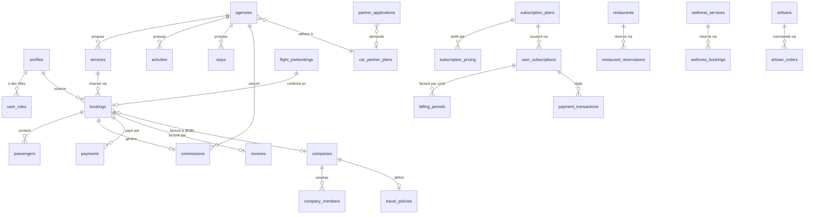

# 04 — Base de données

> Sources : [src/integrations/supabase/types.ts](../../src/integrations/supabase/types.ts) (types générés, 3337 lignes) et les 74 fichiers de [supabase/migrations/](../../supabase/migrations/).

## 1. ⚠️ Constat transversal majeur — désynchronisation `types.ts` / migrations réelles

**`types.ts` n'est pas à jour avec l'historique réel des migrations, dans les deux sens :**

1. Il contient encore **18 tables du module « Majestic Club »** (`majestic_*` ×11, `concierge_requests`, `concierge_staff`, `exclusive_services`, `service_bookings`, `assistance_logs`, `vip_events`, `vip_event_registrations`) que la migration [supabase/migrations/20260805000000_drop_majestic_club.sql](../../supabase/migrations/20260805000000_drop_majestic_club.sql) **supprime explicitement** (`DROP TABLE ... CASCADE`) le 2026-08-05. **Ceci explique l'écart de tables constaté en Phase 1** : ces tables ont réellement existé et existent encore dans les types générés, mais n'existent plus en base depuis cette migration.
2. Il **ne contient pas 9 tables** créées par des migrations plus récentes (à partir du 2026-09-10) : `companies`, `company_members`, `restaurants`, `restaurant_reservations`, `artisans`, `artisan_orders`, `travel_policies`, `wellness_services`, `wellness_bookings` — ni plusieurs colonnes ajoutées après coup à des tables existantes (`bookings.company_id/approval_status/approved_by/approved_at`, `restaurants.average_ticket_price`, `commissions.source_type/source_id`, `invoices.booking_id`, `agencies.car_plan_id/car_plan_started_at`, `reviews.status/source/reviewer_name`).
3. Plusieurs migrations récentes (à partir de `20260909*`) contiennent une note explicite indiquant que **le CLI Supabase est cassé pour ce projet** et qu'elles doivent être exécutées manuellement dans le SQL Editor — rien ne garantit donc que toutes ont réellement été appliquées en production, ce qui pourrait expliquer une partie du décalage restant.

**Conclusion méthodologique** : pour l'état actuel probable du schéma, **les migrations SQL sont la source la plus fiable** (36 tables Majestic/VIP en moins, 9 tables en plus par rapport à `types.ts`). `types.ts` reste la source la plus précise pour les *types TypeScript exacts* des tables qui n'ont pas bougé récemment. **Action recommandée** : régénérer `types.ts` (`supabase gen types typescript`) pour resynchroniser le typage frontend avec le schéma réel.

## 2. Schéma des tables par domaine

*(Format : `table` — colonnes principales, type ; FK **explicites** = déclarées dans `types.ts`/`Relationships`, FK `[déduction]` = déduites du nom de colonne uniquement.)*

### 2.1 Utilisateurs, rôles, profils
| Table | Colonnes clés | Relations |
|---|---|---|
| `profiles` | `id` (PK = `auth.users.id`), `avatar_url?`, `full_name?`, `phone?` | — |
| `user_roles` | `id`, `user_id` [déduction], `role` (enum `app_role` : `admin`\|`user`\|`sub_agency`) | — |
| `dashboard_preferences` | `id`, `user_id` [déduction], `layout_name`, `widgets_config: Json` | — |
| `push_subscriptions` | `id`, `user_id` [déduction], `endpoint`, `p256dh`, `auth` | — |
| `otp_codes` | `id`, `destination`, `channel`, `code_hash`, `purpose`, `expires_at`, `consumed_at?` | pas de `user_id` — identifie par `destination` seule ; **RLS activée sans aucune policy** (accès fermé, edge functions uniquement via `service_role`) |

### 2.2 Catalogue et réservations génériques
| Table | Colonnes clés | Relations |
|---|---|---|
| `services` | `id`, `agency_id?`, `name`, `price_per_unit`, `type` (enum `service_type`: hotel/flight/car/tour/event/flight_hotel/stay) | **FK →** `agencies.id` |
| `bookings` | `id`, `user_id` [déduction], `service_id`, `status` (enum `booking_status`), `payment_status` (enum `payment_status`), `total_price`, `pnr?`, `external_ref?` ; *(non dans types.ts)* `company_id`, `approval_status`, `approved_by`, `approved_at` | **FK →** `services.id` |
| `passengers` | `id`, `booking_id`, `first_name`, `last_name`, `document_type?`, `document_number?` | **FK →** `bookings.id` |
| `reviews` | `id`, `service_id`, `booking_id?`, `user_id?`, `rating`, `status`, `source`, `reviewer_name?` | **FK →** `services.id`, `bookings.id` |
| `activities`, `stays` | `id`, `agency_id?`, `name`, `price_per_unit`, `currency` | **FK →** `agencies.id` |
| `flight_prebookings` | `id`, `user_id` [déduction], `booking_reference`, `flight_data: Json`, `price_signature?`, `status`, `expires_at` | — |
| `price_alerts` | `id`, `user_id` [déduction], `destination`, `target_price?`, `current_price?`, `is_active` | — |

### 2.3 Paiements, facturation, abonnements
| Table | Colonnes clés | Relations |
|---|---|---|
| `payments` | `id`, `user_id` [déduction], `booking_id?`, `subscription_id?`, `amount`, `status`, `transaction_id?`, `ip_address?` | **FK →** `bookings.id`, abonnements |
| `payment_methods` | `id`, `user_id` [déduction], `type`, `provider`, `is_default?` | — |
| `payment_transactions` | `id`, `user_id` [déduction], `subscription_id?`, `transaction_id`, `status` | **FK →** abonnements |
| `invoices` | `id`, `user_id` [déduction], `billing_period_id?`, `booking_id?`, `invoice_number`, `total_amount` | **FK →** `billing_periods.id`, `bookings.id` |
| `billing_periods` | `id`, `user_subscription_id`, `amount`, `billing_cycle`, `status` | **FK →** abonnements |
| `subscription_plans` | `id`, `plan_id` (clé métier), `name`, `subscription_type`, `features?: Json` | — |
| `subscription_pricing` | `id`, `plan_id`, `billing_cycle`, `price` | **FK →** `subscription_plans.plan_id` |
| `subscription_requests` | `id`, `plan_id`, `name`, `email`, `status` | — (formulaire, pas de FK utilisateur) |
| `user_subscriptions` | `id`, `user_id` [déduction], `plan_id` [déduction], `status`, `amount_paid?`, `payment_method_id?` | **FK →** `payment_methods.id` |
| `commissions` | `id`, `agency_id`, `booking_id`, `commission_amount`, `status` ; *(non dans types.ts)* `source_type`, `source_id` (étendu à restaurants/wellness/artisans) | **FK →** `agencies.id`, `bookings.id` |

### 2.4 Agences et partenaires
| Table | Colonnes clés | Relations |
|---|---|---|
| `agencies` | `id`, `owner_id` [déduction], `name`, `commission_rate?`, `is_active?`, `car_plan_id?` | **FK →** `car_partner_plans.plan_id` |
| `car_partner_plans` | `id`, `plan_id`, `name`, `monthly_price`, `commission_rate`, `features: Json` | — |
| `partner_applications` | `id`, `name`, `contact_email`, `requested_car_plan_id?`, `status` | **FK →** `car_partner_plans.plan_id` |
| `promotions` | `id`, `agency_id?`, `discount`, `original_price` | **FK →** `agencies.id` |

### 2.5 ⚠️ Conciergerie « Majestic » / VIP — supprimée de la base le 2026-08-05
18 tables encore présentes dans `types.ts` mais **absentes de la base réelle** depuis [20260805000000_drop_majestic_club.sql](../../supabase/migrations/20260805000000_drop_majestic_club.sql) : `majestic_bookings`, `majestic_documents`, `majestic_itineraries`, `majestic_messages`, `majestic_notifications`, `majestic_payments`, `majestic_properties`, `majestic_service_requests`, `majestic_services`, `majestic_subscriptions`, `majestic_transactions`, `concierge_requests`, `concierge_staff`, `exclusive_services`, `service_bookings`, `assistance_logs`, `vip_events`, `vip_event_registrations`. **Ne pas utiliser ces types dans du nouveau code.**

### 2.6 « Eden Circle » / Luxe — module de remplacement partiel (non supprimé)
| Table | Colonnes clés | Relations |
|---|---|---|
| `luxe_properties` | `id`, `name`, `location`, `price_info?`, `virtual_tour_url?` | — |
| `luxe_stay_details` | `id`, `booking_id`, `smart_lock_code?`, `welcome_guide_url?` | **FK →** `bookings.id` (1-1) |
| `concierge_services` | `id`, `name`, `category`, `price_range?` | — (distincte de l'ancien module Majestic) |

### 2.7 CMS / contenu du site (12 tables)
`page_sections`, `site_config`, `homepage_features`, `homepage_sections`, `bossiz_global_config`, `bossiz_sites_config`, `customizable_plans`, `testimonials`, `value_propositions`, `advertisements`, `global_settings`, `email_templates` — toutes suivent le même schéma d'accès (lecture publique, écriture admin, voir §3).

### 2.8 Technique
`destinations_cache` (cache de recherche, TTL 1h), `integration_credentials` (identifiants prestataires, admin-only), `newsletter_subscribers`.

### 2.9 Tables créées par des migrations récentes, absentes de `types.ts` (à régénérer)
`companies`, `company_members` (self-service entreprise via fonctions `is_company_member`/`is_company_admin`), `restaurants`, `restaurant_reservations`, `artisans`, `artisan_orders`, `wellness_services`, `wellness_bookings` (même schéma : catalogue géré par le propriétaire d'agence via `has_role('sub_agency') AND is_agency_owner(...)`, admin manage all), `travel_policies` (politique de voyage d'entreprise, lecture par les membres, gestion par les admins d'entreprise).

## 3. Diagramme ERD (domaines principaux, schéma actuel réel post-migrations)

## 4. Row Level Security (RLS)

373 occurrences de `ENABLE ROW LEVEL SECURITY`/`CREATE POLICY`/`DROP POLICY` dans les migrations (88 activations RLS, 223 créations de policy). **Toutes les tables actuelles ont RLS activée avec au moins une policy**, à une exception près :

- **`otp_codes`** : RLS activée mais **aucune policy créée** — accès totalement fermé côté client (confirmé par commentaire explicite dans [20260806000000_integration_credentials_and_otp.sql:75-79](../../supabase/migrations/20260806000000_integration_credentials_and_otp.sql)), uniquement accessible via les Edge Functions en `service_role`.

**Patterns récurrents par domaine** :

| Domaine | Règle générale |
|---|---|
| Données personnelles (`profiles`, `bookings`, `payments`, `passengers`…) | Lecture/écriture limitées à `auth.uid() = user_id` (ou équivalent), + accès complet pour `has_role(auth.uid(), 'admin')` |
| Catalogue (`services`, `activities`, `stays`, `restaurants`, `artisans`, `wellness_services`) | Lecture publique (`USING (true)` ou filtre `available=true`), écriture réservée au propriétaire d'agence (`has_role('sub_agency') AND is_agency_owner(...)`) et aux admins |
| Contenu CMS (section 2.7) | Lecture publique, écriture admin uniquement |
| Formulaires publics (`partner_applications`, `subscription_requests`, `newsletter_subscribers`) | INSERT public/anonyme, SELECT/UPDATE réservés aux admins |
| Champs financiers sensibles | Verrouillés par **triggers dédiés** empêchant leur écriture directe par le propriétaire : `enforce_booking_status` ([20260910210000](../../supabase/migrations/20260910210000_lock_booking_status.sql)), `enforce_review_status`, `enforce_user_subscription_status` ([20260916000001](../../supabase/migrations/20260916000001_lock_user_subscriptions_status.sql)), `enforce_agency_protected_fields` ([20260916000002](../../supabase/migrations/20260916000002_lock_agency_financial_fields.sql)) — un utilisateur/agence ne peut pas s'auto-attribuer un statut `confirmed`/`paid` ou modifier son propre `commission_rate`. **Bonne pratique de défense en profondeur**, complémentaire aux vérifications applicatives des Edge Functions.

**Anomalie de stockage (bucket `site-assets`)** : les policies d'upload/update/delete du bucket public `site-assets` ne vérifient en réalité que `bucket_id = 'site-assets'`, **pas le rôle admin/sub_agency** malgré leur nom laissant penser le contraire ([20260120085817:11-21](../../supabase/migrations/20260120085817_fe5794d1.sql)) — à corriger, voir [11-securite.md](11-securite.md).

**Correctif de sécurité notable** : [20260916000000_remove_admin_email_backdoor.sql](../../supabase/migrations/20260916000000_remove_admin_email_backdoor.sql) supprime explicitement une ancienne logique qui attribuait automatiquement le rôle admin sur la base d'une adresse email codée en dur — corrigé, mais témoigne d'une faille de sécurité passée (« backdoor »). Détail en [11-securite.md](11-securite.md).

## 5. Historique des 74 migrations

| Période | Contenu principal |
|---|---|
| 2024-04 (3 migrations) | Socle initial : `user_subscriptions`, `subscription_plans`/`pricing`, `payment_transactions` |
| 2025-01 (6 migrations) | Module Majestic Club complet (conciergerie de luxe), CMS de base, cycles de facturation |
| 2025-10-28 → 2025-12 (~25 migrations) | Socle applicatif principal : `profiles`, `services`, `bookings`, `reviews`, `user_roles`/`app_role`, `payments`, `passengers`, `activities`/`stays`, `agencies`, `commissions`, durcissement RLS itératif |
| 2026-01 → 2026-07 (~10 migrations) | `flight_prebookings`, `advertisements`, bucket `site-assets`, Eden Circle (`luxe_*`), config Bossiz (`bossiz_*`), homepage config, corrections de bugs de paiement (statut `processing`, tracking IP, coût fournisseur, normalisation devise) |
| 2026-08-03 → 2026-08-24 (5 migrations) | Policy admin sur `passengers`, **suppression du module Majestic**, correctif trigger de rôle, `integration_credentials`/`otp_codes`, `partner_applications` |
| 2026-09-09 → 2026-09-22 (14 migrations) | Extension business travel : `car_partner_plans`, lien facture-réservation, bucket documents conducteur, modération avis, verrouillage statuts réservation, **`companies`/`company_members`** (B2B), `artisans`, `travel_policies`/workflow d'approbation, fournisseurs de notification, **suppression de la backdoor admin par email**, verrouillage abonnements/agences, bucket logos partenaires, `wellness_services`, extension commissions multi-source, `artisan_orders`, registre de templates email |

Détail fichier par fichier disponible sur demande (74 entrées, rythme d'évolution très actif sur septembre 2026 — cohérent avec le développement en cours de fonctionnalités business travel/marketplace local).

## 6. Fichiers SQL orphelins hors du pipeline de migration officiel

Trois fichiers SQL existent en dehors de [supabase/migrations/](../../supabase/migrations/) et **ne font pas partie du pipeline de migration Supabase** :

| Fichier | Statut |
|---|---|
| [database/migrations/add_majestic_plans.sql](../../database/migrations/add_majestic_plans.sql) | Script d'insertion de données pour 3 plans Majestic. **Orphelin et obsolète** — le module Majestic a été explicitement purgé (`DELETE FROM subscription_plans WHERE subscription_type = 'majestic'`) et le `CHECK` restreint à `'standard'` uniquement par [20260805000000_drop_majestic_club.sql](../../supabase/migrations/20260805000000_drop_majestic_club.sql). Ce script échouerait s'il était rejoué aujourd'hui. |
| [migrate-majestic.sql](../../migrate-majestic.sql) (racine) | Script de création complète du schéma Majestic (quasi-doublon de `20250101120000`/`20250101120001`, avec des différences mineures de schéma). **Redondant et obsolète** — les tables qu'il crée ont depuis été supprimées par la migration officielle. |
| [supabase/create_missing_tables.sql](../../supabase/create_missing_tables.sql) | Script de secours (`CREATE TABLE IF NOT EXISTS`) recréant `user_subscriptions`, `payment_transactions`, `subscription_plans`, `subscription_pricing`. **Entièrement redondant** avec les migrations officielles de 2024-04 ; n'introduit rien de nouveau. |

**Recommandation** : ces trois fichiers devraient être supprimés du dépôt ou déplacés vers une archive clairement identifiée (`archive/` ou équivalent), pour éviter toute confusion future ou exécution accidentelle contre une contrainte `CHECK` désormais incompatible.
