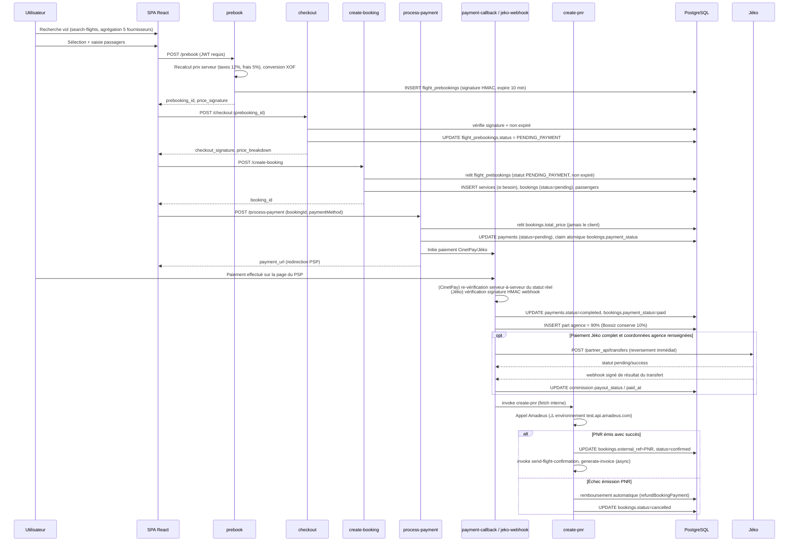
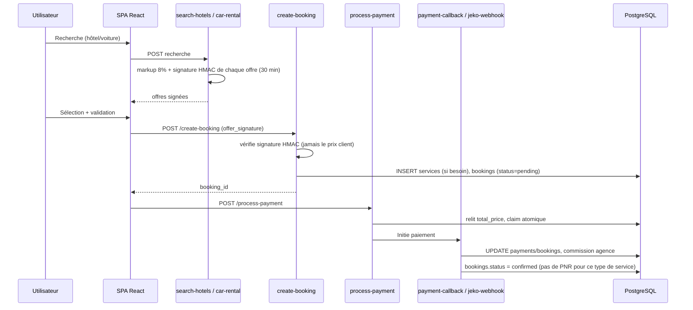
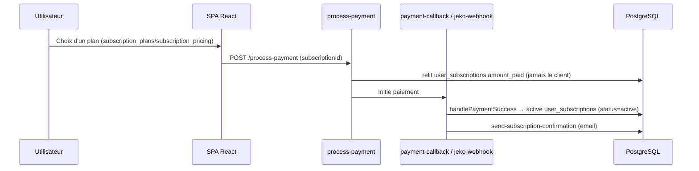
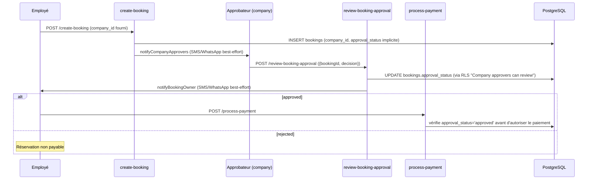
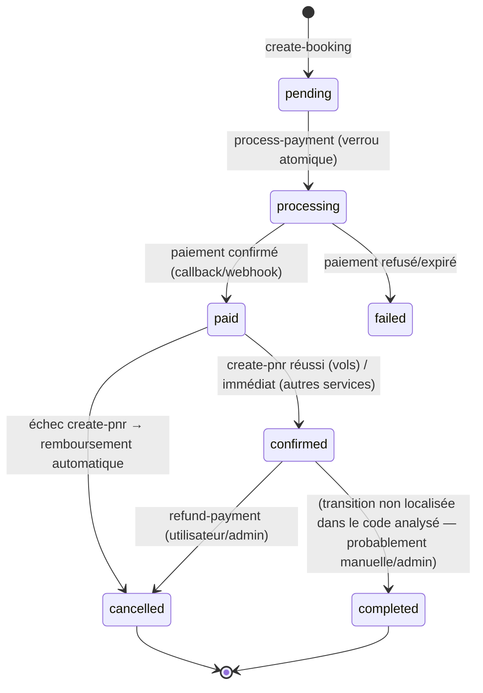

# 08 — Flux critiques

> Reconstitué à partir de la lecture des Edge Functions ([06-fonctions-serveur.md](06-fonctions-serveur.md)) et des triggers/policies SQL ([04-base-de-donnees.md](04-base-de-donnees.md)). Les statuts indiqués sont ceux réellement observés dans le code (colonnes `bookings.status`/`payment_status`, `flight_prebookings.status`, `payments.status`).

## 1. Réservation d'un vol (flux le plus complexe — 4 étapes serveur)

**Statuts observés** :
- `flight_prebookings.status` : `PREBOOKED` → `PENDING_PAYMENT` → (`EXPIRED` si non payé sous 10 min)
- `bookings.status` : `pending` → `confirmed` (PNR émis) ou `cancelled` (échec PNR, remboursé)
- `bookings.payment_status` : `pending` → `processing` (verrou atomique anti double-paiement) → `paid` / `failed`

**Point notable** : `create-pnr` refuse explicitement de fabriquer un faux PNR si Amadeus échoue — il déclenche un remboursement automatique plutôt qu'une confirmation mensongère (comportement constaté par commentaire de code explicite). L'URL Amadeus utilisée pointe vers l'environnement de **test**, pas production — à vérifier avant mise en production réelle du flux vol.

## 2. Réservation hôtel / voiture / activité (flux simplifié, sans prebook)

**Différence clé avec le flux vol** : pas d'étape `prebook`/`checkout` séparée ni d'appel GDS — le booking passe directement à `confirmed` après paiement réussi (via `handlePaymentSuccess` dans `_shared/postPaymentSuccess.ts`). **Exception notable** : `search-flight-hotel-packages` et `search-trains` n'appliquent **pas** de signature d'offre, contrairement à `search-hotels`/`car-rental` — leur intégrité de prix au moment de la réservation n'est donc pas garantie par le même mécanisme (à vérifier/documenter séparément).

## 3. Paiement — détail des deux prestataires

### CinetPay ([payment-callback](../../supabase/functions/payment-callback/index.ts))
- Webhook **sans vérification de signature cryptographique** du body reçu.
- Protection réelle : re-vérification serveur-à-serveur systématique via `POST https://api-checkout.cinetpay.com/v2/payment/check` avec la clé API secrète du marchand — le statut du body du webhook n'est **jamais** utilisé directement pour valider un paiement.
- Idempotent par `transaction_id`.

### Jèko ([jeko-webhook](../../supabase/functions/jeko-webhook/index.ts))
- Webhook **avec vérification de signature HMAC-SHA256** (header `Jeko-Signature`), comparaison à temps constant, calculée sur le corps brut avant parsing JSON.
- Secret stocké dans `integration_credentials` (admin-only RLS).
- Idempotent par `transaction_id` + `payment_provider='jeko'`.

Les deux chemins convergent vers `handlePaymentSuccess()` ([_shared/postPaymentSuccess.ts](../../supabase/functions/_shared/postPaymentSuccess.ts)). Pour une vente liée à une agence, la part agence est enregistrée à 90% du montant (Bossiz conserve 10%). Seuls les paiements complets encaissés par Jèko peuvent déclencher un transfert automatique. Les billets d'avion attendent l'émission du vrai PNR avant de programmer le transfert, afin qu'un échec fournisseur suivi d'un remboursement ne paie pas l'agence.

### Reversements agence Jèko

- Le partenaire choisit à sa candidature un moyen de réception pris en charge par Jèko : Wave, Orange Money, MTN, Moov, DJAMO ou virement bancaire (RIB). Après validation, il saisit le nom du bénéficiaire et ses coordonnées dans **Espace agence → Paramètres**. Les coordonnées sont dans une table privée dont la lecture/écriture est limitée au propriétaire de l'agence et aux admins.
- À la confirmation d'un paiement Jèko complet, une ligne de reversement est créée avec échéance à 24 h et une référence idempotente `bossiz-<commission_id>`. Si les coordonnées sont complètes, l'appel au transfert Jèko est initié immédiatement; sinon le reversement attend leur saisie. Le webhook Jèko signé confirme ensuite le statut final. Le traitement n'effectue pas de nouvel envoi automatique en cas de résultat ambigu : l'admin doit d'abord vérifier la référence dans le cockpit Jèko.
- L'appel sortant est désactivé par défaut. Définir le secret Supabase Edge `JEKO_PAYOUTS_ENABLED=true` active les transferts réels; il faut d'abord confirmer les clés Jèko, le solde du magasin marchand et les coordonnées bénéficiaires. **Jèko ne fournit pas d'environnement sandbox : un appel de transfert déplace de l'argent réel. Aucun transfert réel ne doit être utilisé comme test.**
- La migration recalcule à 90% la part des commissions encore en attente; ces anciennes lignes restent en reversement manuel et ne sont pas envoyées automatiquement.
- Les paiements CinetPay et les réservations réglées directement auprès du partenaire ne sont pas transférés automatiquement par le portefeuille Jèko. Les virements bancaires ont un minimum documenté de 20 000 XOF; Moov a un minimum de 100 XOF. Les autres méthodes Mobile Money ont un minimum de 5 XOF.

## 4. Remboursement ([refund-payment](../../supabase/functions/refund-payment/index.ts))

- Déclenché par le propriétaire du booking ou un admin (RPC `has_role`).
- Appelle l'API CinetPay refund (`https://api-checkout.cinetpay.com/v2/payment/refund/add`).
- ⚠️ **Le module partagé [_shared/cinetpayRefund.ts](../../supabase/functions/_shared/cinetpayRefund.ts) indique lui-même en commentaire que cette API n'a jamais été testée en conditions réelles** — à valider en sandbox avant de considérer ce flux comme fiable en production.
- Sur succès : `bookings.status='cancelled'`, `payments.status`/`bookings.payment_status='refunded'`.
- Également déclenché automatiquement par `create-pnr` en cas d'échec d'émission du PNR (voir §1).

## 5. Abonnements (Business/Conciergerie)

- `user_subscriptions.status`/`amount_paid` sont verrouillés par un trigger (`enforce_user_subscription_status`, [20260916000001](../../supabase/migrations/20260916000001_lock_user_subscriptions_status.sql)) empêchant un utilisateur non-admin de s'auto-activer ou de modifier le montant payé — seul un flux serveur (`service_role`) ou un admin peut le faire.
- Facturation récurrente : `billing_periods` (cycles), mais **aucun mécanisme de relance/renouvellement automatique n'a été identifié dans les Edge Functions analysées** — à vérifier plus avant (cron `pg_cron` activé dans [20260104183657](../../supabase/migrations/20260104183657_2151ab23.sql), mais aucune tâche planifiée n'a été localisée dans ce dépôt pour le renouvellement d'abonnement).

## 6. Business Travel — workflow d'approbation entreprise

**Point notable** : `review-booking-approval` ne fait **aucun contrôle de rôle explicite dans son propre code** — l'autorisation repose entièrement sur la policy RLS "Company approvers can review their company bookings" : si la RLS refuse, l'`UPDATE` ne matche simplement aucune ligne. C'est un choix d'architecture valide (délégation à la base) mais qui rend ce flux plus difficile à auditer/tester unitairement sans accès direct aux policies SQL.

## 7. Machine à états — réservation (`bookings`)

**Note méthodologique** : cette machine à états combine les colonnes `bookings.status` (`pending`/`confirmed`/`cancelled`/`completed`, enum `booking_status`) et `bookings.payment_status` (`pending`/`processing`/`paid`/`refunded`/`failed`, enum `payment_status`), qui évoluent en partie indépendamment dans le code. La transition `confirmed → completed` n'a été localisée dans aucune Edge Function analysée — **[déduction]** elle est probablement déclenchée manuellement par un admin (page `/admin/bookings`) plutôt que par une automatisation, mais ceci n'a pas été vérifié directement dans le code de cette page.

## 5. Abonnement partenaire voiture

- Les forfaits « Découverte » gratuits sont supprimés; chaque forfait restant doit avoir un tarif mensuel et annuel strictement positif. Les montants existants des forfaits Pro/Flotte restent la source de vérité.
- Un partenaire authentifié choisit un forfait et une périodicité sur `/partenaires/voitures`. PostgreSQL recalcule le montant à partir de `car_partner_plans`; `process-payment` relit le montant enregistré, réclame atomiquement l'abonnement, puis crée un lien Jèko. Seul le webhook signé Jèko active l'abonnement.
- `car_partner_subscriptions` ne permet aux partenaires que de créer une demande `pending` et de lire leurs propres demandes. Aucune écriture client ne peut marquer un paiement comme réussi. Une souscription payée, active, non expirée et liée à un forfait actif est exigée par un trigger PostgreSQL pour toute nouvelle annonce voiture et toute publication; le plafond de véhicules du forfait est aussi vérifié côté base.
- La migration conserve les services voiture déjà enregistrés. Les mises à jour des offres existantes restent possibles; une nouvelle annonce ou la republication après expiration exige une souscription payée valide. Appliquer la migration et déployer `process-payment`, `payment-callback` et `jeko-webhook` ensemble avant d'ouvrir le parcours en production. Aucun paiement n'est déclenché par ces changements locaux.

## 6. Photos de profil et récupération de mot de passe

- `Account` enregistre la photo de profil dans `profiles.avatar_url`. Le téléchargement passe par `upload-site-asset` vers le bucket public `site-assets`; un utilisateur ordinaire est autorisé uniquement dans `profile-avatars/<son-UUID>`, tandis que les rôles admin/agence gardent leurs dossiers existants. L'URL publique et l'aperçu synchronisé sont réutilisés dans les barres latérales utilisateur et agence.
- Les liens de récupération sont créés par `send-password-reset` et redirigent en PKCE vers `/reset-password`. `SITE_URL` (par défaut `https://app.bossiz.com`) doit être une URL de redirection autorisée dans **Supabase Auth → URL Configuration** du projet déployé; les URLs locales sont aussi déclarées dans `supabase/config.toml`. Un utilisateur Google peut définir un mot de passe Bossiz après récupération; cela ne réinitialise pas son mot de passe Google.
